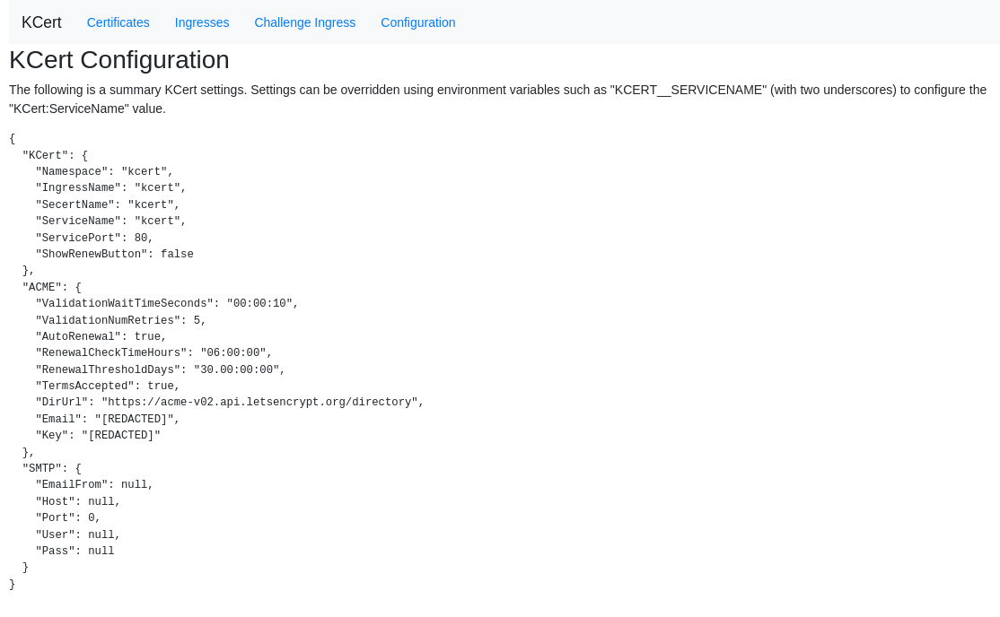

# Auto DNS and SSL

Here we are going to configure automatic domain name attribution for our deployments and automatic SSL for security.

Steps:
- Configure DNS
- Install `nginx-ingress`
- Install `kcert`

# Explanation

My `DevBox` is hosted at home behind my ISP's router.


Using this setup i'll be able to deploy many apps with SSL and a DNS record automatically.

I wanted to use `external-dns` to avoid DNS wildcard which is not recommanded but that's the only way I found to make this work...

## DNS

The only thing you need is an A record pointing to your IP and a wildcard CNAME.

I'm using a A record because of `DDNS Updater`. But it is not necessary.


If you have a Dynamic IP adress and you use `cloudflare` you can use: [DDNS Updater](../../../Apps/DDNS_Updater/README.md)

## Nginx ingress

The Ingress is a Kubernetes resource that lets you configure an HTTP load balancer for applications running on Kubernetes.

Installation:

```bash
kubectl install -f ingress-nginx.yaml
```

Add the annotatoin to specify that this is the only instance of Ingress Nginx:

```bash
kubectl -n ingress-nginx annotate ingressclasses nginx ingressclass.kubernetes.io/is-default-class="true"
```

Now head to your domain name and test it!

If you got a 404 error don't worry that's normal.

### Testing

To test if our ingress is configured correctly you'll need to deploy a test app like `whoami`

```bash
kubectl apply -f whoami.yaml
```

Wait for the app to deploy an head to the host you set in `whoami.yaml`

```
curl whoami.example.org

Hostname: whoami-7c88bd4c6f-zlhnj
IP: 127.0.0.1
IP: ::1
IP: 10.244.0.64
IP: fe80::ec93:5ff:fe87:230
RemoteAddr: 10.244.0.1:38304
GET / HTTP/1.1
Host: whoami.example.org
User-Agent: curl/7.81.0
Accept: */*
X-Forwarded-For: 192.168.1.254
X-Forwarded-Host: whoami.example.org
X-Forwarded-Port: 80
X-Forwarded-Proto: http
X-Forwarded-Scheme: http
X-Real-Ip: 192.168.1.254
X-Request-Id: 878e5ee5ad293615126fb5426a973f52
X-Scheme: http
```


## Kcert

[Kcert](https://github.com/nabsul/kcert) is a lightweight [cert-manager](https://cert-manager.io/) alternative.

Installation:

```bash
kubectl apply -f kcert.yaml
```

Don't forget to edit `ACME__EMAIL`

Access the UI:

`Kcert` has a WebUI to help you see the registered certificates and Ingress

```bash
kubectl -n kcert port-forward svc/kcert 8080
```

And access `localhost:8080` on your machine.



You can now test `kcert` by deploying a secured version of `whoami`.

```bash
kubectl delete -f whoami.yaml #Uninstall the old version
kubectl apply -f whoami-ssl.yaml #Install the SSL version
```

Wait a bit and now you have SSL/TLS secured web apps!